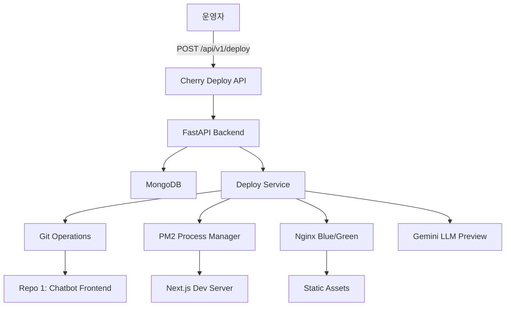

# 🚀 Cherry Deploy: Delightful Deployment Experience

> **SoftBank Hackathon 2025 - Team Cherry**  
> "Make Deployment Delightful" 테마 프로젝트

배포를 **테마파크 놀이기구처럼** 만들기 - 빠르고, 안전하고, 재미있는 배포 경험을 제공합니다.

---

## 📋 목차

- [프로젝트 개요](#-프로젝트-개요)
- [핵심 컨셉](#-핵심-컨셉)
- [시스템 아키텍처](#-시스템-아키텍처)
- [주요 기능](#-주요-기능)
- [기술 스택](#-기술-스택)
- [프로젝트 구조](#-프로젝트-구조)
- [API 명세](#-api-명세)
- [개발 현황](#-개발-현황)
- [배포 및 실행](#-배포-및-실행)
- [환경 설정](#-환경-설정)
- [팀 정보](#-팀-정보)

---

## 🎯 프로젝트 개요

Cherry Deploy는 **배포 경험을 재정의**하는 DevOps 자동화 플랫폼입니다. 기존 배포의 고통스러운 경험을 제거하고, 개발자가 자신감을 가지고 배포할 수 있도록 설계되었습니다.

### 해결하고자 하는 문제

#### 개발자의 고통 (Pain Points)
- ❌ **롤백이 느리고 복잡**: 새 버전 실패 시 즉시 원복 어려움
- ❌ **실패 원인 파악 어려움**: 로그가 여러 서비스에 흩어져 있음
- ❌ **동시 배포 충돌**: 여러 명이 배포하면 환경이 꼬임
- ❌ **배포에 대한 공포**: 작은 변경도 "릴리스 = 불안"으로 인식

#### 소비자의 불편
- 📉 배포 타이밍에 속도 저하
- ⚠️ 롤링 배포 중 에러 페이지 노출
- 🔄 버전 섞임 현상
- ⏰ 기능 업데이트 지연

---

## 💡 핵심 컨셉

### "Delightful Deploy" 정의

배포를 **테마파크 놀이기구**에 비유:

| 놀이기구 경험 | 배포 시스템 |
|------------|-----------|
| � **줄이 짧다** (대기시간↓) | 클릭 한 번에 빠른 배포 |
| 🔒 **안전바 단단** (안전장치↑) | 문제 발생 시 즉시 롤백 |
| 📸 **사진/성적표 제공** (관측↑) | 전/후 성능·리소스 차이 확인 |
| 👥 **친구랑 같이 탄다** (동시성↑) | 여러 명이 안전하게 협업 |
| 🎵 **BGM/연출** (재미↑) | "또 배포하고 싶다"는 감정 |

### 핵심 가치

> **"버튼 1번으로 빠르고 안전하며 보이는 변화가 있고,  
> 여럿이 써도 안 부서지며, 심지어 재미까지 있는 배포 경험"**

---

## 🏗️ 시스템 아키텍처

### 2-Repo (Polyrepo) 구조

프로젝트는 **2개의 독립된 리포지토리**로 구성되어 Git 충돌을 원천 차단합니다.

```
/home/ec2-user/projects/
├── SB_Hackathon_Cherry_Chatbot/   # [Repo 1] 배포 대상 (Next.js 프론트엔드)
│   └── frontend/my-dashboard/      # Next.js 앱
│
└── SB_Hackathon_Cherry_Deploy/     # [Repo 2] 배포 시스템 (본 프로젝트)
    ├── app_main.py                 # FastAPI 메인 애플리케이션
    ├── api-code/                   # 백엔드 소스코드
    ├── mongodb/                    # MongoDB 바이너리
    ├── mongodb-data/               # MongoDB 데이터 디렉터리
    └── swagger-api/                # API 문서
```

### 시스템 구성



---

## ✨ 주요 기능

### 1. 🔄 Blue/Green 무중단 배포

- **Nginx 심볼릭 링크 기반** Blue/Green 전환
- 배포 중 기존 버전 유지로 **무중단 서비스**
- 실패 시 즉시 이전 슬롯으로 롤백 가능

### 2. 🤖 AI 기반 변경사항 프리뷰

- **Gemini 2.5 Flash** 모델을 활용한 Git diff 분석
- 배포 전 예상 변경사항, 위험요소, 테스트 권장사항 자동 생성
- 코스트 추정 및 소요 시간 예측

### 3. ⚡ 자동 롤백 (Auto-Recovery)

- `npm install` 또는 PM2 시작 실패 시 **자동 롤백**
- 직전 성공 커밋으로 자동 복구
- 롤백 과정 및 결과 메타데이터에 기록

### 4. 🔐 동시성 제어

- **서버 레벨 락(AsyncReentrantLock)**으로 배포 직렬화
- 여러 사용자의 동시 배포 요청 충돌 방지
- Race Condition 원천 차단

### 5. � 실시간 배포 상태 추적

- 배포 파이프라인 각 단계별 상태 모니터링
- 타임라인 기반 진행 상황 표시
- `/api/v1/status/{task_id}`로 폴링

### 6. 🔁 원클릭 롤백

- `/api/v1/rollback` 엔드포인트로 즉시 롤백
- 최근 2개의 성공 배포 이력 기반
- Git 커밋 단위로 정확한 버전 복원

---

## �🛠️ 기술 스택

### Backend
- **FastAPI** - 고성능 Python 웹 프레임워크
- **MongoDB (Motor)** - 비동기 MongoDB 드라이버
- **Google Gemini API** - AI 기반 코드 분석
- **asyncio** - 비동기 작업 처리

### Frontend (배포 대상)
- **Next.js** - React 프레임워크
- **TypeScript** - 타입 안전성

### Infrastructure
- **AWS EC2** - 애플리케이션 호스팅
- **Nginx** - 리버스 프록시 & Blue/Green 전환
- **PM2** - Node.js 프로세스 관리
- **Let's Encrypt** - HTTPS 인증서
- **Git** - 소스 코드 관리

### DevOps
- **Blue/Green Deployment** - 무중단 배포 전략
- **Git-based Workflow** - 브랜치 기반 배포 관리
- **Subprocess Management** - 명령어 실행 및 오류 처리

---

## 📁 프로젝트 구조

```
SB_Hackathon_Cherry_Deploy/
├── app_main.py                 # FastAPI 애플리케이션 엔트리포인트
├── requirements.txt            # Python 의존성
├── AGENTS.md                   # 운영 메모
├── developmentplan.html        # 개발 전략 문서
├── systemDevPlan.html          # 시스템 설계 문서
│
├── api-code/                   # 백엔드 소스코드
│   ├── env_loader.py           # 환경변수 로더
│   ├── settings.py             # 설정 관리
│   │
│   ├── db/                     # 데이터베이스
│   │   ├── mongo.py            # MongoDB 연결
│   │   └── __init__.py
│   │
│   ├── domain/                 # 도메인 모델
│   │   ├── deploy_states.py   # 배포 상태 정의
│   │   └── __init__.py
│   │
│   ├── models/                 # 데이터 모델
│   │   ├── deploy.py           # 배포 태스크 모델
│   │   └── __init__.py
│   │
│   ├── repositories/           # 저장소 계층
│   │   ├── deploy_tasks.py    # MongoDB 리포지토리
│   │   ├── in_memory.py        # 인메모리 리포지토리
│   │   └── __init__.py
│   │
│   ├── routers/                # API 라우터
│   │   ├── chat.py             # 챗봇 API
│   │   ├── deploy.py           # 배포 API
│   │   ├── health.py           # 헬스체크 API
│   │   └── __init__.py
│   │
│   ├── schemas/                # Pydantic 스키마
│   │   ├── chat.py             # 챗봇 요청/응답
│   │   ├── deploy.py           # 배포 요청/응답
│   │   └── __init__.py
│   │
│   └── services/               # 비즈니스 로직
│       ├── chat_service.py     # Gemini 챗봇 서비스
│       ├── deploy_service.py   # 배포 오케스트레이션 (1443줄)
│       └── __init__.py
│
├── mongodb/                    # MongoDB 바이너리 (로컬 설치)
│   └── bin/
│       ├── mongod
│       └── mongos
│
├── mongodb-data/               # MongoDB 데이터 디렉터리 (Git 제외)
│
├── swagger-api/                # API 문서
│   ├── openapi.yaml            # 전체 API 스펙
│   ├── deploy-api.yaml         # 배포 API 스펙
│   ├── chat-api.yaml           # 챗봇 API 스펙
│   ├── preview-api.yaml        # 프리뷰 API 스펙
│   └── status-api.yaml         # 상태 API 스펙
│
└── tests/                      # 단위 테스트
    └── test_deploy_service.py  # DeployService 테스트
```

---

## 📡 API 명세

### Base URL
- **Production**: `https://delight.13-125-116-92.nip.io`
- **Local**: `http://127.0.0.1:9001`

### 배포 API

#### POST `/api/v1/deploy`
새로운 배포 트리거

**Request Body:**
```json
{
  "branch": "deploy"  // 기본값: "deploy", 허용: "deploy", "main"
}
```

**Response (202 Accepted):**
```json
{
  "task_id": "fd2c3a1d8f1f4d59b6d3f6c5d30d2f7a",
  "status": "pending",
  "branch": "deploy",
  "action": "deploy",
  "queued_at": "2025-11-07T10:30:00+09:00",
  "estimated_duration_minutes": 8,
  "dev_server_restart_planned": true
}
```

#### GET `/api/v1/status/{task_id}`
배포 작업 상태 조회

**Response:**
```json
{
  "task_id": "...",
  "status": "running_build",
  "metadata": {...},
  "stages": {
    "running_clone": {...},
    "running_build": {...}
  },
  "started_at": "2025-11-07T10:30:00+09:00",
  "completed_at": null,
  "cost_estimate": {...},
  "risk_assessment": {...},
  "llm_preview": {...}
}
```

#### POST `/api/v1/rollback`
이전 배포로 롤백

**Request Body:**
```json
{
  "branch": "deploy"  // 선택사항
}
```

**Response (202 Accepted):**
```json
{
  "task_id": "...",
  "status": "pending",
  "branch": "deploy",
  "action": "rollback",
  "context": {
    "from_commit": "abc123...",
    "to_commit": "def456..."
  }
}
```

#### GET `/api/v1/preview`
배포 전 미리보기

**Response:**
```json
{
  "current_branch": "deploy",
  "risk_assessment": {
    "risk_level": "medium",
    "files_changed": 12
  },
  "cost_estimate": {
    "runtime_minutes": 8,
    "hourly_cost": 1.33
  },
  "llm_preview": {
    "summary": "Updates to frontend components...",
    "highlights": ["..."],
    "risks": ["..."]
  },
  "timeline_preview": [...]
}
```

#### GET `/api/v1/tasks/recent`
최근 배포 이력 조회

**Query Params:**
- `limit`: 조회할 태스크 수 (기본: 5, 최대: 20)

#### GET `/api/v1/tasks/{task_id}/logs`
특정 배포의 상세 로그

### 챗봇 API

#### POST `/api/v1/chat`
Gemini 챗봇과 대화

**Request Body:**
```json
{
  "message": "안녕하세요"
}
```

**Response:**
```json
{
  "reply": "안녕하세요! 무엇을 도와드릴까요?",
  "model": "gemini-2.5-flash"
}
```

### 헬스체크 API

#### GET `/healthz`
서비스 상태 확인

---

## 🚀 개발 현황

### ✅ 완료된 기능

#### 1. 핵심 배포 파이프라인 (100% 완료)
- [x] Git 클론/체크아웃 단계 (`running_clone`)
- [x] 빌드 단계 (`running_build`)
- [x] Blue/Green 컷오버 단계 (`running_cutover`)
- [x] 관측성 단계 (`running_observability`)
- [x] 4단계 파이프라인 상태 관리

#### 2. 배포 오케스트레이션 (100% 완료)
- [x] `DeployService` 핵심 로직 (1,443줄)
- [x] 비동기 태스크 실행 (BackgroundTasks)
- [x] 서버 레벨 락 구현 (`AsyncReentrantLock`)
- [x] 명령어 실행 및 에러 핸들링
- [x] Dry-run 모드 지원

#### 3. 자동 롤백 시스템 (100% 완료)
- [x] 실패 감지 로직
- [x] 자동 복구 트리거
- [x] 직전 성공 커밋 기반 롤백
- [x] 롤백 결과 메타데이터 기록
- [x] `failure_context.auto_recovery` 추적

#### 4. AI 기반 프리뷰 (100% 완료)
- [x] Gemini 2.5 Flash 통합
- [x] Git diff 분석 및 요약
- [x] 변경사항 하이라이트 추출
- [x] 위험도 평가 (low/medium/high)
- [x] 테스트 권장사항 생성

#### 5. 데이터베이스 (100% 완료)
- [x] MongoDB 통합 (Motor)
- [x] `deploy_tasks` 컬렉션 스키마
- [x] 인덱싱 및 쿼리 최적화
- [x] 인메모리 폴백 리포지토리
- [x] 최근 성공 배포 조회

#### 6. API 엔드포인트 (100% 완료)
- [x] `POST /api/v1/deploy`
- [x] `POST /api/v1/rollback`
- [x] `GET /api/v1/status/{task_id}`
- [x] `GET /api/v1/preview`
- [x] `GET /api/v1/tasks/recent`
- [x] `GET /api/v1/tasks/{task_id}/logs`
- [x] `POST /api/v1/chat` (Gemini 챗봇)
- [x] `GET /healthz`

#### 7. 인프라 설정 (100% 완료)
- [x] EC2 환경 구성 (IP: 13.125.116.92)
- [x] Nginx 리버스 프록시 설정
- [x] HTTPS (Let's Encrypt) 적용
- [x] 도메인: `delight.13-125-116-92.nip.io`
- [x] PM2 프로세스 관리 (`main-api`)
- [x] MongoDB 로컬 설치 및 실행

#### 8. 브랜치 전략 (100% 완료)
- [x] 2-Repo 구조 확립
- [x] `deploy` 브랜치 기본값
- [x] `main` 브랜치 옵션 지원
- [x] 브랜치 검증 로직
- [x] Git 충돌 방지 설계

#### 9. 문서화 (100% 완료)
- [x] Swagger/OpenAPI 스펙 (`swagger-api/`)
- [x] 개발 전략 문서 (`developmentplan.html`)
- [x] 시스템 설계 문서 (`systemDevPlan.html`)
- [x] 운영 가이드 (`AGENTS.md`)
- [x] API 문서 (5개 YAML 파일)

#### 10. 테스트 (90% 완료)
- [x] 단위 테스트 프레임워크 (`test_deploy_service.py`)
- [x] 인메모리 리포지토리 목 구현
- [ ] 통합 테스트 시나리오 추가 예정

### 🔧 현재 개발 중 / 향후 계획

#### Phase 2 (선택사항)
- [ ] Prometheus 메트릭 수집
- [ ] Grafana 대시보드
- [ ] Slack/Discord 알림 통합
- [ ] Lighthouse 성능 측정
- [ ] 배포 일정 예약 기능

---

## 🎬 배포 파이프라인 흐름

### 1. 트리거 (Trigger)
```
운영자 → POST /api/v1/deploy → FastAPI
```

### 2. Git 동기화 (`running_clone`)
```bash
git fetch origin
git checkout -B deploy origin/deploy
git reset --hard origin/deploy
git clean -fdx
```

### 3. 빌드 (`running_build`)
```bash
cd /home/ec2-user/projects/SB_Hackathon_Cherry_Chatbot/frontend/my-dashboard
npm install
pm2 start npm --name frontend-dev -- run dev
```

### 4. 컷오버 (`running_cutover`)
```bash
# Dev 서버 모드에서는 스킵
# 정적 빌드 시:
cp -r out/ /var/www/cherry-deploy/blue
ln -sfn blue /var/www/cherry-deploy/current
sudo systemctl reload nginx
```

### 5. 관측성 (`running_observability`)
```bash
# Gemini로 Git diff 요약 생성
# PM2 상태 확인
# 헬스체크 엔드포인트 호출
```

### 6. 완료 (`completed`)
```
메타데이터 저장 → MongoDB
커밋 정보, 작업자, 타임스탬프 기록
```

---

## 💻 배포 및 실행

### 사전 요구사항

```bash
# Python 3.12
python --version

# Node.js & npm
node --version
npm --version

# PM2
npm install -g pm2

# Nginx
sudo systemctl status nginx

# MongoDB (로컬 설치됨)
./mongodb/bin/mongod --version
```

### 설치 및 실행

#### 1. 리포지토리 클론
```bash
cd /home/ec2-user/projects
git clone <repo-url> SB_Hackathon_Cherry_Deploy
cd SB_Hackathon_Cherry_Deploy
```

#### 2. Python 의존성 설치
```bash
pip install -r requirements.txt
```

#### 3. 환경변수 설정
```bash
cp .env.example .env
# .env 파일 편집하여 GEMINI_API_KEY 등 설정
```

#### 4. MongoDB 시작
```bash
./mongodb/bin/mongod \
  --dbpath mongodb-data \
  --bind_ip 127.0.0.1 \
  --port 27017 \
  --fork \
  --logpath mongodb-data/mongod.log
```

#### 5. FastAPI 서버 시작 (PM2)
```bash
pm2 start "uvicorn app_main:app --host 0.0.0.0 --port 9001" --name main-api
pm2 save
```

#### 6. 부팅 시 자동 시작 설정
```bash
sudo env PATH=$PATH:/usr/bin \
  /usr/lib/node_modules/pm2/bin/pm2 startup systemd \
  -u ec2-user --hp /home/ec2-user
```

#### 7. Nginx 설정 확인
```bash
sudo nginx -t
sudo systemctl reload nginx
```

### 서비스 확인

```bash
# PM2 프로세스 상태
pm2 status

# API 헬스체크
curl https://delight.13-125-116-92.nip.io/healthz

# 로그 확인
pm2 logs main-api
```

---

## ⚙️ 환경 설정

### 환경변수 (.env)

```bash
# Gemini API
GEMINI_API_KEY=your_gemini_api_key_here

# MongoDB
MONGODB_URI=mongodb://127.0.0.1:27017
MONGODB_DB_NAME=cherry_deploy

# 리포지토리 경로
CHATBOT_REPO_PATH=/home/ec2-user/projects/SB_Hackathon_Cherry_Chatbot

# Nginx Blue/Green 경로
NGINX_GREEN_PATH=/var/www/cherry-deploy/green
NGINX_BLUE_PATH=/var/www/cherry-deploy/blue
NGINX_LIVE_SYMLINK=/var/www/cherry-deploy/current

# 배포 설정
DEPLOY_DRY_RUN=false
DEPLOY_DEFAULT_BRANCH=deploy
DEPLOY_ALLOWED_BRANCHES=deploy,main

# 프론트엔드 설정
FRONTEND_PROJECT_SUBDIR=frontend/my-dashboard
FRONTEND_INSTALL_COMMAND=npm install
FRONTEND_BUILD_COMMAND=bash -lc "npm run build"
FRONTEND_EXPORT_COMMAND=npm run export
FRONTEND_BUILD_OUTPUT_SUBDIR=out

# LLM 프리뷰 설정
PREVIEW_LLM_MODEL=gemini-2.5-flash
PREVIEW_DIFF_MAX_CHARS=8000

# 디스플레이 설정
DISPLAY_TIMEZONE=Asia/Seoul
```

### PM2 생태계 파일 (ecosystem.config.js)

```javascript
module.exports = {
  apps: [{
    name: 'main-api',
    script: 'uvicorn',
    args: 'app_main:app --host 0.0.0.0 --port 9001',
    interpreter: 'python3',
    env: {
      DEPLOY_DRY_RUN: 'false',
    }
  }]
};
```

---

## 🎯 핵심 데모 시나리오

### 시나리오 1: Blue/Green 무중단 배포
1. 프론트엔드 코드 변경 후 Repo1 `deploy` 브랜치에 푸시
2. `POST /api/v1/deploy` 호출
3. Green → Blue 또는 Blue → Green으로 자동 전환
4. 사용자는 배포 중에도 기존 버전 사용 가능
5. 새 버전 활성화 후 즉시 트래픽 전환

### 시나리오 2: AI 기반 변경사항 프리뷰
1. `GET /api/v1/preview` 호출
2. Gemini가 Git diff 분석
3. 변경사항 요약, 위험도, 테스트 권장사항 표시
4. 예상 소요 시간 및 비용 확인
5. 안전하게 배포 진행

### 시나리오 3: 자동 롤백
1. 배포 중 `npm install` 실패
2. 시스템이 자동으로 직전 성공 커밋 감지
3. 자동 롤백 트리거
4. Git reset, npm install, PM2 재시작
5. `failure_context.auto_recovery`에 결과 기록

---

## 📊 개발 통계

- **총 코드 라인**: ~3,500+ 줄
- **핵심 서비스 (`deploy_service.py`)**: 1,443 줄
- **API 엔드포인트**: 8개
- **배포 파이프라인 단계**: 4단계
- **지원 브랜치**: 2개 (deploy, main)
- **테스트 케이스**: 340+ 줄

---

## 🍒 팀 정보

**Team Cherry** - SoftBank Hackathon 2025

### 프로젝트 담당
- **Backend MVP**: sungwoo (`sungwoo/feature/backend-mvp` 브랜치)
- **Infrastructure**: AWS EC2, Nginx, MongoDB, PM2 설정
- **AI Integration**: Gemini 2.5 Flash 통합

### 연락처
- **서버**: EC2 Public IP `13.125.116.92`
- **도메인**: `delight.13-125-116-92.nip.io`
- **Repository**: `sungwoocse/SB_Hackathon_Cherry_Deploy`

---

## 📚 추가 문서

- [AGENTS.md](./AGENTS.md) - 운영 가이드 및 명령어
- [developmentplan.html](./developmentplan.html) - 개발 전략 및 문제 정의
- [systemDevPlan.html](./systemDevPlan.html) - 시스템 설계 및 아키텍처
- [swagger-api/openapi.yaml](./swagger-api/openapi.yaml) - 전체 API 스펙
- [tests/test_deploy_service.py](./tests/test_deploy_service.py) - 단위 테스트

---

## 🎉 결론

Cherry Deploy는 **배포를 즐거운 경험으로 만드는** 것을 목표로 합니다.

- ✅ **Fast**: 클릭 한 번에 빠른 배포
- ✅ **Safe**: 자동 롤백과 Blue/Green 전환
- ✅ **Observable**: AI 기반 프리뷰와 실시간 상태 추적
- ✅ **Collaborative**: 동시성 제어로 안전한 협업
- ✅ **Delightful**: "또 배포하고 싶다"는 경험

> **"Make Deployment Delightful"** 🚀

---

**Last Updated**: 2025-11-07  
**Version**: 0.1.0 (MVP)  
**Status**: Production Ready ✨
